```mermaid
%%{init: {'theme': 'base', 'themeVariables': { 'primaryColor': '#6366f1', 'primaryTextColor': '#fff', 'primaryBorderColor': '#4338ca', 'lineColor': '#64748b', 'secondaryColor': '#f1f5f9', 'tertiaryColor': '#e0e7ff'}}}%%
flowchart LR
    A(("👆 User<br/>Action")) --> B["⚡ Event"]
    B --> C{"eventSink"}
    C --> D["🧠 StateHolder<br/>(Logic)"]
    D --> E["📦 State<br/>(Immutable)"]
    E --> F(("📱 UI<br/>(Composable)"))
    F -.-> A
    
    style A fill:#6366f1,stroke:#4338ca,stroke-width:2px,color:#fff,shadow:true
    style F fill:#6366f1,stroke:#4338ca,stroke-width:2px,color:#fff,shadow:true
    style D fill:#10b981,stroke:#059669,stroke-width:2px,color:#fff,shadow:true
    style E fill:#f59e0b,stroke:#d97706,stroke-width:2px,color:#fff,shadow:true
    style B fill:#e0e7ff,stroke:#6366f1,color:#1e1b4b,stroke-dasharray: 5 5
```

# Trapeze Project Guide

> **For AI Agents**: This document provides comprehensive context for understanding and contributing to the Trapeze codebase. Read this entire document before making changes.

## Project Overview
A Pure-Compose driven architectural library implementing the **MESA framework** (Modular, Explicit, State-driven, Architecture). The library facilitates a rigid UDF (Unidirectional Data Flow) where the UI is a stateless projection of a single State object.

## Libraries
| Library | Purpose | Key Exports |
|---------|---------|-------------|
| **Trapeze** | Core architecture | `TrapezeStateHolder`, `TrapezeState`, `TrapezeScreen`, `TrapezeEvent`, `TrapezeContent`, `Trapeze`, `TrapezeCompositionLocals` |
| **TrapezeNavigation** | Navigation layer | `NavigableTrapezeContent`, `TrapezeBackStack`, `TrapezeNavigator`, `LocalTrapezeNavigator` |
| **Strata** | Business logic layer | `StrataInteractor`, `StrataSubjectInteractor`, `StrataResult`, `strataLaunch` |

## MESA Pillars
- **Modular**: Feature isolation by design; components are decoupled and portable.
- **Explicit**: All interactions are defined through the Screen, State, and Event contracts.
- **State-driven**: The State object is the Single Source of Truth (SSoT) and contains the event processing hook.
- **Architecture**: Provides the structural "Trapeze" to swing between Logic and UI.

---

## Technical Contract

### The Five Components
| Component | Role | Type Requirements |
|-----------|------|-------------------|
| **Screen** | Identity/destination key | `Parcelable`, implements `TrapezeScreen` |
| **State** | Immutable display data + event sink | Implements `TrapezeState`, contains `eventSink: (E) -> Unit` |
| **Event** | User interactions | Implements `TrapezeEvent`, typically `sealed interface` |
| **StateHolder** | Logic layer producing State | Extends `TrapezeStateHolder<S, T, E>` |
| **UI** | Stateless Composable | Signature: `@Composable (Modifier, State) -> Unit` |

### Data Flow
### Data Flow


---

## Factory Pattern (Circuit-Style)

Trapeze uses a **Circuit-style factory pattern** for decoupled UI and StateHolder creation.

### Core Classes
- **`Trapeze`**: Central registry holding `StateHolderFactory` and `UiFactory` sets. Built via `Trapeze.Builder()`.
- **`TrapezeCompositionLocals`**: Provides `Trapeze` instance down the composition tree via `LocalTrapeze`.
- **`TrapezeContent`**: Resolves factories from `LocalTrapeze` and renders the screen.

### Factory Interfaces
```kotlin
// In Trapeze.kt
interface StateHolderFactory {
    fun create(screen: TrapezeScreen, navigator: TrapezeNavigator?): TrapezeStateHolder<*, *, *>?
}

interface UiFactory {
    fun create(screen: TrapezeScreen): TrapezeUi<*>?
}
```

### Creating Factories (per feature)
```kotlin
// In features/foo/presentation/FooFactories.kt
@ContributesIntoSet(AppScope::class)
class FooStateHolderFactory @Inject constructor(
    private val factory: FooStateHolder.Factory
) : Trapeze.StateHolderFactory {
    override fun create(screen: TrapezeScreen, navigator: TrapezeNavigator?): TrapezeStateHolder<*, *, *>? {
        return if (screen is FooScreen && navigator != null) {
            factory.create(navigator)
        } else null
    }
}

@ContributesIntoSet(AppScope::class)
class FooUiFactory @Inject constructor() : Trapeze.UiFactory {
    override fun create(screen: TrapezeScreen): TrapezeUi<*>? {
        return if (screen is FooScreen) ::FooUi else null
    }
}
```

### Assisted Inject for StateHolders
Use `@AssistedInject` for runtime dependencies (navigator, interop), regular injection for graph dependencies (use cases):

```kotlin
class FooStateHolder @AssistedInject constructor(
    @Assisted private val navigator: TrapezeNavigator,  // Runtime - from factory call
    private val fooUseCase: Lazy<FooUseCase>            // Graph - from DI
) : TrapezeStateHolder<FooScreen, FooState, FooEvent>() {
    
    @AssistedFactory
    fun interface Factory {
        fun create(navigator: TrapezeNavigator): FooStateHolder
    }
}
```

---

## Navigation (TrapezeNavigation)

### Components
| Component | Purpose |
|-----------|---------|
| `NavigableTrapezeContent` | Main entry point - renders current screen from backstack |
| `TrapezeBackStack` | Saveable navigation stack with Parcelable support |
| `rememberSaveableBackStack(root)` | Creates saveable backstack with root screen |
| `rememberTrapezeNavigator(backStack)` | Creates navigator backed by backstack |
| `LocalTrapezeNavigator` | CompositionLocal for accessing navigator |

### Usage Pattern
```kotlin
// In Activity
TrapezeCompositionLocals(trapeze) {
    val backStack = rememberSaveableBackStack(root = HomeScreen)
    val navigator = rememberTrapezeNavigator(backStack)
    
    NavigableTrapezeContent(navigator, backStack)
}
```

### TrapezeNavigator Interface
```kotlin
interface TrapezeNavigator {
    fun navigate(screen: TrapezeScreen)
    fun pop()
}
```

---

## Clean Architecture & Modules

### Module Structure (per feature)
```
features/foo/
  ├── api/           # Public interfaces. Stable API surface.
  │   ├── FooScreen.kt
  │   └── FooUseCase.kt
  ├── domain/        # Business logic. Internal.
  │   ├── FooUseCaseImpl.kt
  │   └── FooRepository.kt
  ├── data/          # Repository implementations.
  │   └── FooRepositoryImpl.kt
  └── presentation/  # UI + StateHolder + DI bindings.
      ├── FooStateHolder.kt
      ├── FooFactories.kt
      └── FooUi.kt
```

### Dependency Rules
- `presentation` → depends on → `api`, `domain`
- `domain` → depends on → `api`, `data`
- `api` → no internal dependencies

---

## Strata Patterns

### Interactor Types
| Type | Use Case | Return |
|------|----------|--------|
| `StrataInteractor<P, R>` | One-shot async (API calls, DB writes) | `StrataResult<R>` |
| `StrataSubjectInteractor<P, T>` | Streams/flows (observe data) | `Flow<T>` via `.flow` |

### Error Handling
```kotlin
strataLaunch {
    saveData(params).onFailure { error: StrataException ->
        // Handle error
    }
}
```

### Triggering Subject Interactors
- MUST invoke in UI/Logic layer (e.g., `LaunchedEffect`)
- Do NOT trigger in UseCase `init` blocks

```kotlin
LaunchedEffect(Unit) {
    observeData(params)  // Starts the flow
}
val data by observeData.flow.collectAsState(initial = null)
```

---

## Dependency Injection (Metro)

### Graph Setup
```kotlin
@DependencyGraph(AppScope::class)
interface AppGraph : MetroAppComponentProviders {
    @Multibinds val stateHolderFactories: Set<Trapeze.StateHolderFactory>
    @Multibinds val uiFactories: Set<Trapeze.UiFactory>
    
    val trapeze: Trapeze
        @Provides get() = Trapeze.Builder()
            .apply { stateHolderFactories.forEach { addStateHolderFactory(it) } }
            .apply { uiFactories.forEach { addUiFactory(it) } }
            .build()
}
```

### Key Annotations
| Annotation | Purpose |
|------------|---------|
| `@ContributesBinding(AppScope::class)` | Bind implementation to interface |
| `@ContributesIntoSet(AppScope::class)` | Add to multibinding set (factories) |
| `@AssistedInject` / `@AssistedFactory` | Runtime dependency injection |
| `@Inject` | Standard constructor injection |

### Member Injection (Activities)
```kotlin
class MainActivity : ComponentActivity() {
    @Inject lateinit var trapeze: Trapeze
}
```

---

## Coding Standards

### Required Practices
- **UDF Flow**: UI → Event → eventSink → StateHolder → State → UI
- **No ViewModels**: Logic belongs in `TrapezeStateHolder`
- **Stateless UI**: Composables never hold business logic or persistent state
- **Inject Interfaces**: Never inject concrete implementations
- **Use `Lazy<T>`**: For heavy dependencies to delay initialization

### License Headers
All source files MUST include Apache 2.0 license header:
```kotlin
/*
 * Copyright 2026 Jason Jamieson
 *
 * Licensed under the Apache License, Version 2.0 (the "License");
 * ...
 */
```
Year format: `2026` (if current year) or `2026-<currentYear>`.

---

## Common Patterns

### Event Safety
Wrap event sink to ensure CoroutineScope is active:
```kotlin
val wrappedSink = wrapEventSink(eventSink)
```

### State Persistence
Use `rememberSaveable` in StateHolder for state that survives process death:
```kotlin
var count by rememberSaveable { mutableIntStateOf(0) }
```

### Interop (Activity Communication)
```kotlin
interface AppInterop : TrapezeInterop {
    fun send(event: AppInteropEvent)
}

// Bound via @ContributesBinding
@ContributesBinding(AppScope::class)
class AppInteropImpl @Inject constructor(private val context: Context) : AppInterop
```