# Trapeze Framework

A type-safe, MESA-inspired architecture for Jetpack Compose. Trapeze enforces strict separation between logic (StateHolder), presentation (UI), and identity (Screen) with a Circuit-style factory pattern for decoupled component resolution.

## 📚 Libraries

| Library | Purpose | Key Components |
|---------|---------|----------------|
| **Trapeze** | Core architecture | `TrapezeStateHolder`, `TrapezeState`, `TrapezeScreen`, `TrapezeEvent`, `TrapezeContent`, `Trapeze` |
| **TrapezeNavigation** | Navigation layer | `NavigableTrapezeContent`, `TrapezeBackStack`, `TrapezeNavigator`, `LocalTrapezeNavigator` |
| **Strata** | Business logic | `StrataInteractor`, `StrataSubjectInteractor`, `StrataResult`, `strataLaunch` |

---

## 🏗️ Trapeze Architecture

Trapeze implements the **MESA pattern** (Modular, Explicit, State-driven, Architecture).

### The Five Components

| Component | Role | Requirements |
|-----------|------|--------------|
| **Screen** | Identity/destination key | `Parcelable`, implements `TrapezeScreen` |
| **State** | Immutable display data + event sink | Implements `TrapezeState` |
| **Event** | User interactions | Implements `TrapezeEvent` |
| **StateHolder** | Logic layer producing State | Extends `TrapezeStateHolder<S, T, E>` |
| **UI** | Stateless Composable | `@Composable (Modifier, State) -> Unit` |

### Data Flow

```mermaid
%%{init: {'theme': 'base', 'themeVariables': { 'primaryColor': '#6366f1', 'primaryTextColor': '#fff', 'primaryBorderColor': '#4338ca', 'lineColor': '#64748b', 'secondaryColor': '#f1f5f9', 'tertiaryColor': '#e0e7ff'}}}%%
flowchart LR
    A(("👆 User<br/>Action")) --> B["⚡ Event"]
    B --> C{"eventSink"}
    C --> D["🧠 StateHolder<br/>(Logic)"]
    D --> E["📦 State<br/>(Immutable)"]
    E --> F(("📱 UI<br/>(Composable)"))
    F -.-> A
    
    style A fill:#6366f1,stroke:#4338ca,stroke-width:2px,color:#fff,shadow:true
    style F fill:#6366f1,stroke:#4338ca,stroke-width:2px,color:#fff,shadow:true
    style D fill:#10b981,stroke:#059669,stroke-width:2px,color:#fff,shadow:true
    style E fill:#f59e0b,stroke:#d97706,stroke-width:2px,color:#fff,shadow:true
    style B fill:#e0e7ff,stroke:#6366f1,color:#1e1b4b,stroke-dasharray: 5 5
```



### Architecture Overview

```mermaid
%%{init: {'theme': 'base', 'themeVariables': { 'clusterBkg': '#f8fafc', 'clusterBorder': '#cbd5e1' }}}%%
flowchart TB
    subgraph APP["🏠 App Module"]
        direction TB
        MA["MainActivity"]
        AG["AppGraph<br/>(Metro/DI)"]
    end
    
    subgraph CORE["📦 Trapeze Core"]
        direction TB
        TR["Trapeze<br/>Registry"]
        TC["TrapezeContent"]
        SHF[["StateHolderFactory<br/>(Interface)"]]
        UIF[["UiFactory<br/>(Interface)"]]
    end
    
    subgraph NAV["🧭 Navigation"]
        direction TB
        NC["NavigableTrapezeContent"]
        BS["TrapezeBackStack"]
        TN["TrapezeNavigator"]
    end
    
    subgraph FEAT["⚡ Feature Module"]
        direction TB
        SCR(["Screen<br/>(Parcelable)"])
        SH["StateHolder<br/>(Implementation)"]
        UI["UI<br/>(Implementation)"]
        FAC>"Factories<br/>(@ContributesIntoSet)"]
    end
    
    MA ==> AG
    AG ==> TR
    NC --> TC
    TC --> TR
    FAC -.->|contributes| SHF
    FAC -.->|contributes| UIF
    TR --> SHF & UIF
    SHF --> SH
    UIF --> UI
    TN --> BS
    
    style APP fill:#f8fafc,stroke:#94a3b8,stroke-width:2px,rx:10
    style CORE fill:#eef2ff,stroke:#6366f1,stroke-width:2px,rx:10
    style NAV fill:#ecfdf5,stroke:#10b981,stroke-width:2px,rx:10
    style FEAT fill:#fffbeb,stroke:#f59e0b,stroke-width:2px,rx:10
    
    style MA fill:#fff,stroke:#334155
    style AG fill:#fff,stroke:#334155,stroke-dasharray: 5 5
```




---


## 🔧 Setup

### 1. Add Dependencies
```kotlin
implementation(project(":Trapeze"))
implementation(project(":TrapezeNavigation"))
implementation(project(":Strata"))
```

### 2. Configure DI Graph (Metro)
```kotlin
@DependencyGraph(AppScope::class)
interface AppGraph : MetroAppComponentProviders {
    @Multibinds val stateHolderFactories: Set<Trapeze.StateHolderFactory>
    @Multibinds val uiFactories: Set<Trapeze.UiFactory>
    
    val trapeze: Trapeze
        @Provides get() = Trapeze.Builder()
            .apply { stateHolderFactories.forEach { addStateHolderFactory(it) } }
            .apply { uiFactories.forEach { addUiFactory(it) } }
            .build()
}
```

### 3. Set Up Activity
```kotlin
class MainActivity : ComponentActivity() {
    @Inject lateinit var trapeze: Trapeze

    override fun onCreate(savedInstanceState: Bundle?) {
        super.onCreate(savedInstanceState)
        setContent {
            TrapezeCompositionLocals(trapeze) {
                val backStack = rememberSaveableBackStack(root = HomeScreen)
                val navigator = rememberTrapezeNavigator(backStack)
                
                NavigableTrapezeContent(navigator, backStack)
            }
        }
    }
}
```

---

## 💻 Creating a Feature

### Step 1: Define Screen, State, Event
```kotlin
@Parcelize
data class CounterScreen(val initialCount: Int) : TrapezeScreen, Parcelable

data class CounterState(
    val count: Int,
    val eventSink: (CounterEvent) -> Unit
) : TrapezeState

sealed interface CounterEvent : TrapezeEvent {
    data object Increment : CounterEvent
    data object Decrement : CounterEvent
}
```

### Step 2: Create StateHolder with Assisted Inject
```kotlin
class CounterStateHolder @AssistedInject constructor(
    @Assisted private val navigator: TrapezeNavigator  // Runtime dependency
) : TrapezeStateHolder<CounterScreen, CounterState, CounterEvent>() {

    @Composable
    override fun produceState(screen: CounterScreen): CounterState {
        var count by rememberSaveable { mutableIntStateOf(screen.initialCount) }

        return CounterState(
            count = count,
            eventSink = { event ->
                when (event) {
                    CounterEvent.Increment -> count++
                    CounterEvent.Decrement -> count--
                }
            }
        )
    }

    @AssistedFactory
    fun interface Factory {
        fun create(navigator: TrapezeNavigator): CounterStateHolder
    }
}
```

### Step 3: Create UI
```kotlin
@Composable
fun CounterUi(modifier: Modifier = Modifier, state: CounterState) {
    Column(modifier = modifier) {
        Text("Count: ${state.count}")
        Row {
            Button(onClick = { state.eventSink(CounterEvent.Decrement) }) {
                Text("-")
            }
            Button(onClick = { state.eventSink(CounterEvent.Increment) }) {
                Text("+")
            }
        }
    }
}
```

### Step 4: Create Factories
```kotlin
@ContributesIntoSet(AppScope::class)
class CounterStateHolderFactory @Inject constructor(
    private val factory: CounterStateHolder.Factory
) : Trapeze.StateHolderFactory {
    override fun create(
        screen: TrapezeScreen,
        navigator: TrapezeNavigator?
    ): TrapezeStateHolder<*, *, *>? {
        return if (screen is CounterScreen && navigator != null) {
            factory.create(navigator)
        } else null
    }
}

@ContributesIntoSet(AppScope::class)
class CounterUiFactory @Inject constructor() : Trapeze.UiFactory {
    override fun create(screen: TrapezeScreen): TrapezeUi<*>? {
        return if (screen is CounterScreen) ::CounterUi else null
    }
}
```

That's it! The factories are automatically discovered via Metro's aggregation and registered with the `Trapeze` instance.

---

## 🧭 Navigation

### TrapezeNavigator
Injectable interface for navigation actions:
```kotlin
interface TrapezeNavigator {
    fun navigate(screen: TrapezeScreen)
    fun pop()
}
```

### Navigation from StateHolder
```kotlin
class CounterStateHolder @AssistedInject constructor(
    @Assisted private val navigator: TrapezeNavigator
) : TrapezeStateHolder<CounterScreen, CounterState, CounterEvent>() {

    @Composable
    override fun produceState(screen: CounterScreen): CounterState {
        return CounterState(
            // ...
            eventSink = { event ->
                when (event) {
                    CounterEvent.GoToDetails -> navigator.navigate(DetailsScreen(count))
                    CounterEvent.GoBack -> navigator.pop()
                }
            }
        )
    }
}
```

### Accessing Navigator in Composables
```kotlin
@Composable
fun SomeComposable() {
    val navigator = LocalTrapezeNavigator.current
    Button(onClick = { navigator.navigate(OtherScreen) }) {
        Text("Navigate")
    }
}
```

---

## 🧠 Strata (Business Logic)

Strata standardizes async operations and error handling.

### Interactor Types

| Type | Use Case | Return |
|------|----------|--------|
| `StrataInteractor<P, R>` | One-shot async (API calls, DB writes) | `StrataResult<R>` |
| `StrataSubjectInteractor<P, T>` | Streams/flows (observe data) | `Flow<T>` via `.flow` |

### One-Shot Interactor
```kotlin
class SaveNote @Inject constructor(
    private val repository: NoteRepository
) : StrataInteractor<NoteParams, Unit>() {
    override suspend fun doWork(params: NoteParams) {
        repository.save(params.id, params.content)
    }
}
```

### Stream Interactor
```kotlin
class ObserveNote @Inject constructor(
    private val repository: NoteRepository
) : StrataSubjectInteractor<String, Note>() {
    override fun createObservable(params: String): Flow<Note> {
        return repository.observe(params)
    }
}
```

### Usage in StateHolder
```kotlin
class NoteStateHolder @AssistedInject constructor(
    @Assisted private val navigator: TrapezeNavigator,
    private val saveNote: Lazy<SaveNote>,
    private val observeNote: Lazy<ObserveNote>
) : TrapezeStateHolder<NoteScreen, NoteState, NoteEvent>() {

    @Composable
    override fun produceState(screen: NoteScreen): NoteState {
        // Trigger stream observation
        LaunchedEffect(screen.noteId) {
            observeNote.value(screen.noteId)
        }
        val note by observeNote.value.flow.collectAsState(initial = null)

        return NoteState(
            note = note,
            eventSink = { event ->
                when (event) {
                    is NoteEvent.Save -> strataLaunch {
                        saveNote.value(event.params).onFailure { error ->
                            // Handle error
                        }
                    }
                }
            }
        )
    }
}
```

---

## 🔌 Dependency Injection (Metro)

### Key Annotations

| Annotation | Purpose |
|------------|---------|
| `@ContributesBinding(AppScope::class)` | Bind implementation to interface |
| `@ContributesIntoSet(AppScope::class)` | Add to multibinding set (factories) |
| `@AssistedInject` / `@AssistedFactory` | Runtime dependency injection |
| `@Inject` | Standard constructor injection |

### Assisted vs Regular Injection

| Dependency Type | Injection Style | Example |
|-----------------|-----------------|---------|
| **Runtime context** | `@Assisted` | `TrapezeNavigator`, `AppInterop` |
| **Graph singletons** | Regular `@Inject` | Use cases, repositories |

```kotlin
class FooStateHolder @AssistedInject constructor(
    @Assisted private val navigator: TrapezeNavigator,  // Runtime
    private val fooUseCase: Lazy<FooUseCase>            // Graph singleton
)
```

---

## 📁 Module Structure

### Clean Architecture Layout
```
features/foo/
  ├── api/           # Public interfaces (stable API)
  │   ├── FooModel.kt
  │   └── FooUseCase.kt
  ├── domain/        # Business logic (internal)
  │   ├── FooUseCaseImpl.kt
  │   └── FooRepository.kt
  ├── data/          # Repository implementations
  │   └── FooRepositoryImpl.kt
  └── presentation/  # UI + StateHolder + Factories
      ├── FooScreen.kt
      ├── FooStateHolder.kt
      ├── FooFactories.kt
      └── FooUi.kt
```

### Dependency Rules
- `presentation` → `api`, `domain`
- `domain` → `api`, `data`
- `api` → no internal dependencies

---

## 🛡️ Best Practices

### UDF Flow
Always follow: UI → Event → eventSink → StateHolder → State → UI

### No ViewModels
Logic belongs in `TrapezeStateHolder`, not Android ViewModels.

### Stateless UI
Composables must never hold business logic or persistent state.

### State Persistence
Use `rememberSaveable` for state that survives configuration changes:
```kotlin
var count by rememberSaveable { mutableIntStateOf(0) }
```

### Event Safety
Wrap event sink using `wrapEventSink` helper:
```kotlin
val wrappedSink = wrapEventSink(eventSink)
```

---

## 📄 License

```
Copyright 2026 Jason Jamieson

Licensed under the Apache License, Version 2.0 (the "License");
you may not use this file except in compliance with the License.
You may obtain a copy of the License at

    http://www.apache.org/licenses/LICENSE-2.0
```
